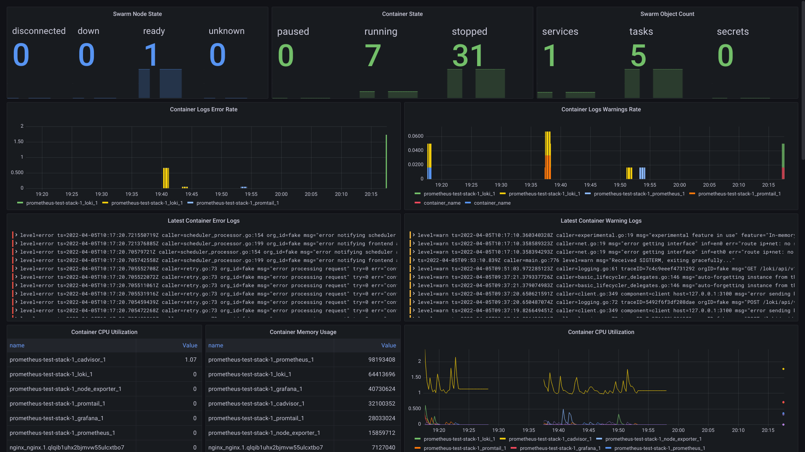

# OVERVIEW
A grafana/prometheus/loki monitoring dashbouard for a docker swarm cluster using docker-compose. Components:

  - grafana
  - prometheus
  - loki
  - promtail
  - cadvisor
  - node-exporter
  - [docker-events-to-logs.sh](https://gist.github.com/sgpinkus/45f6c2728bcfb36bda29b83910fac769)

*NOTES & LIMITATIONS:*

  - All monitoring containers are running in host network and there is lots of bind mounting going on to enable bare system monitoring.
  - Promtail is configured to scrape the local journald logs. Docker needs to be configured to send logs there (see below).
  - scripts/docker-events-to-logs.sh is used to get service container lifecycle events from `docker events`.
  - Will need better, more application specific log parsing in prod.
  - It's impossible to really simulate a multi-node swarm with a docker-compose which assumes single node. Dash works in swarm too but scraper confs need to be updated.

*SCREENSHOT:*

# CONFIGURATION
Docker daemon needs to be running locally, have metrics endpoint enabled, and use journald log-driver. Example:

    {
        "dns": ["8.8.8.8", "8.8.4.4"],
        "hosts": ["unix:///var/run/docker.sock"],
        "containerd": "/run/containerd/containerd.sock",
        "log-driver": "journald",
        "metrics-addr" : "127.0.0.1:9323",
        "experimental" : true
    }

# USAGE
Is like:

    docker-compose up

May take a while after grafana is up for metrics to start coming. Compose file is stateless.

# TODO

  - Apparently node-exporter has trouble getting access to all bare system metrics.
  - Sometimes when you have a container in a crash loop lots of containers show up. [AFAIK](https://stackoverflow.com/q/71706413/2038383) it's annoyingly hard to filter time series to "running right now" rather than "was running then" in PromQL.
  - Better panels ... lots of tweaking ....
